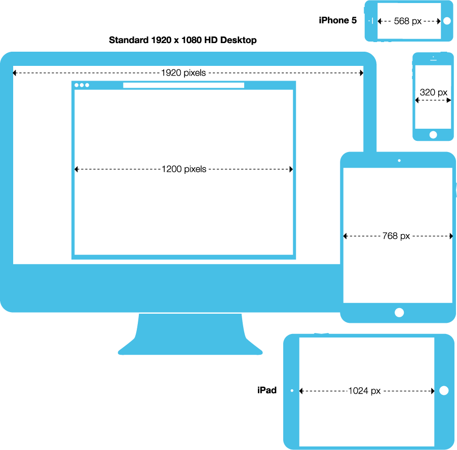
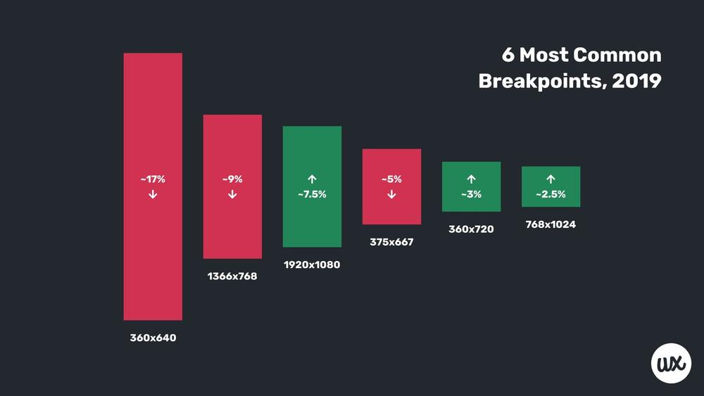

# Formats

## Concepts
- Display Size
- Hardware Pixels
- CSS Pixels

## Screen Resolution

- https://docs.adobe.com/content/help/en/target/using/experiences/vec/mobile-viewports.html
- https://w3codemasters.in/most-common-screen-resolutions-in-2019/

## Breakpoints
- https://gs.statcounter.com/screen-resolution-stats/

